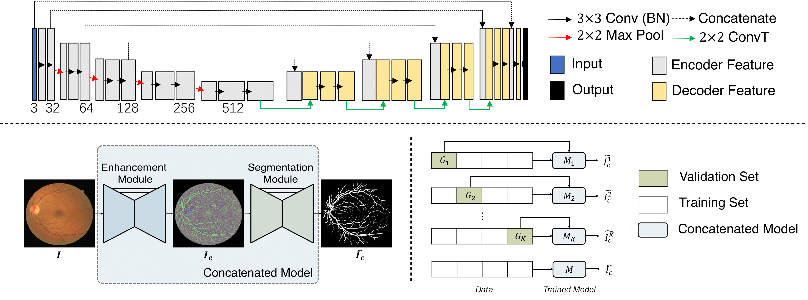
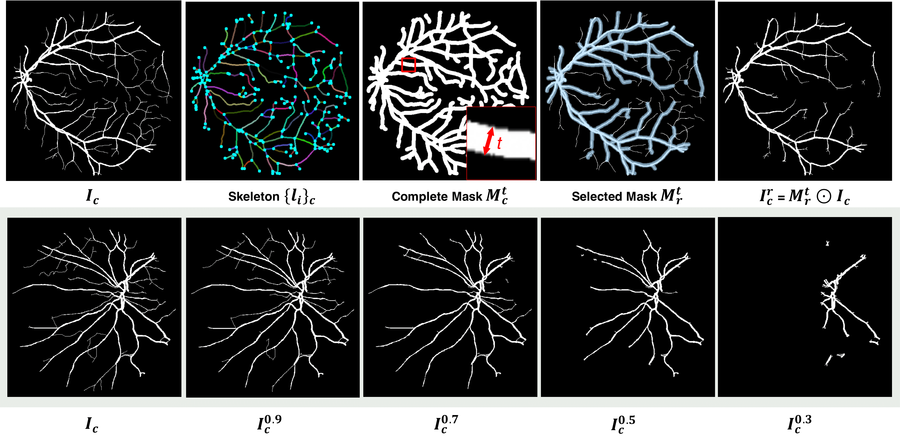
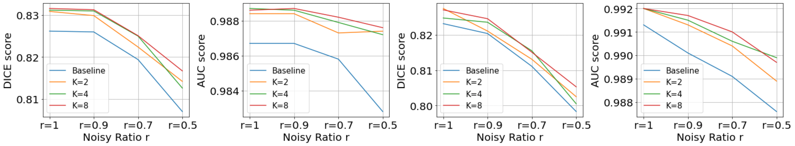
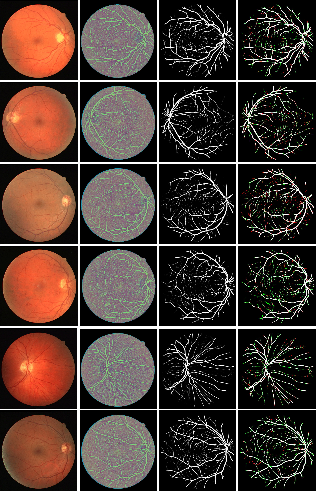

# SGL-Retinal-Vessel-Segmentation
[](https://paperswithcode.com/sota/retinal-vessel-segmentation-on-drive?p=study-group-learning-improving-retinal-vessel)
[](https://paperswithcode.com/sota/retinal-vessel-segmentation-on-chase_db1?p=study-group-learning-improving-retinal-vessel)

This repository is the official PyTorch code for the manuscript 'Study Group Learning: Improving Retinal Vessel Segmentation Trained with Noisy Labels' (Yuqian Zhou, Hanchao Yu, Humphrey Shi)
[[Technical Report]](https://arxiv.org/abs/2103.03451)

## Introduction
<div align="center">
  
  Framework of Study Group Learning.
</div>

Retinal vessel segmentation from retinal images is an essential task for developing the computer-aided diagnosis system for retinal diseases. Efforts have been made on high-performance deep learning-based approaches to segment the retinal images in an end-to-end manner. However, the acquisition of retinal vessel images and segmentation labels requires onerous work from professional clinicians, which results in smaller training dataset with incomplete labels. As known, data-driven methods suffer from data insufficiency, and the models will easily over-fit the small-scale training data. Such a situation becomes more severe when the training vessel labels are incomplete or incorrect. In this paper, we propose a Study Group Learning (SGL) scheme to improve the robustness of the model trained on noisy labels. Besides, a learned enhancement map provides better visualization than conventional methods as an auxiliary tool for clinicians. Experiments demonstrate that the proposed method further improves the vessel segmentation performance in DRIVE and CHASE_DB1 datasets, especially when the training labels are noisy. 

In this repository, we have prepared the raw dataset (DRIVE and CHASE_DB1) and the pretrained model of our paper. 

## Prerequisites

Download our repo:
```
git clone https://github.com/SHI-Labs/SGL-Retinal-Vessel-Segmentation.git
cd SGL-Retinal-Vessel-Segmentation
```
Prepare a PyTorch environment (>=1.3.1) and other necessary dependencies. 

## Training on DRIVE or CHASE_DB1

### Stage 1: Preparing Pseudo-label for SGL
(Optional) If you want to directly test the prepared pseudo-label obtained by SGL, we have prepared them in the dataset folder. Otherwise, you can run the following codes to generate your own Pseudo-labels again. Taking k=8 as an example:
```
cd sgl_labeling
bash run_drive_k8.sh
```

### Stage 2: Training with the Pseudo-label
If you generated the Pseudo-labels by yourself, copy the results in the testing folder to the dataset folder. Otherwise, you can directly run the following codes to train the model on our prepared Pseudo labels.
```
cd sgl_training
bash run_train.sh
```

## Testing on the Pretrained Model
We have prepared the pre-trained models for both datasets in the folder 'pretrained'. To replicate the results in the paper, directly run the following commands,
```
cd sgl_training
bash run_test.sh
```

## Noisy Label Synthesis Pipeline (Vessel Label Erasing)
Annotating the retinal vessels requires the involvement of professional clinicians, and the process of manual labeling is onerous, which reveals one of the reasons why public retinal vessel databases are always small-scale or partially-labeled. It is also common that some labels of thinner vessels are missing due to the annotators' errors. To resemble this practical situation in industry, we propose to synthesize an incomplete map by erasing some labeled vessel segments from the ground truth segmentation map. Please run the python notobook in the noisy_label_synthesis folder.

<div align="center">
  
  Vessel label erasing process. 
</div>

## Quantitative Results on DRIVE and CHASE w/ or w.o./ Noisy Labels
<div align="center">
  
  The proposed SGL learning scheme overall improves the robustness in all k. 
</div>
Erasing some vessel labels in the training set will drastically degrade the system performance, while the SGL learning scheme overall improves the robustness on both datasets. Among all the metrics, AUC does not relate to the thresholding method, indicating a better ability of the model segmenting vessel pixels. 

## Results and Visualization on DRIVE
<div align="center">
  
  Results and Visualization on DRIVE dataset.
</div>

## Citation
If you think this repo and the manuscript helpful, please consider citing us.
```
@article{zhou2021study,
  title={Study Group Learning: Improving Retinal Vessel Segmentation Trained with Noisy Labels},
  author={Zhou, Yuqian and Yu, Hanchao and Shi, Humphrey},
  journal={arXiv preprint arXiv:2103.03451},
  year={2021}
}
```

## Acknowledgements
This project has been funded by the Jump ARCHES endowment through the Health Care Engineering Systems Center. This work also utilizes resources supported by the National Science Foundation’s Major Research Instrumentation program, grant number 1725729, as well as the University of Illinois at Urbana-Champaign.


